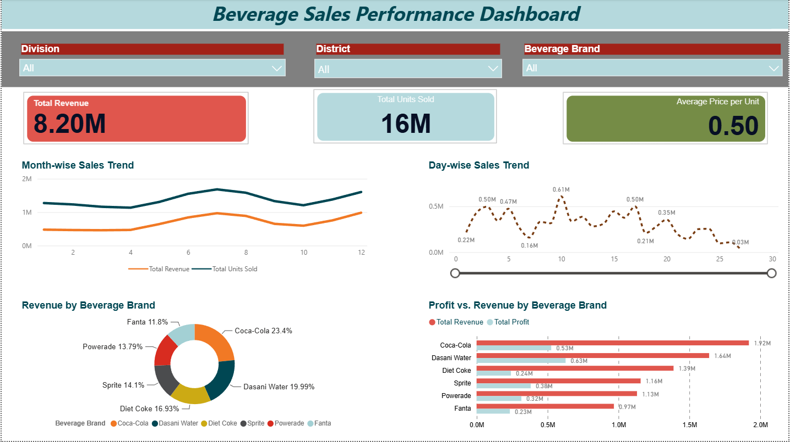
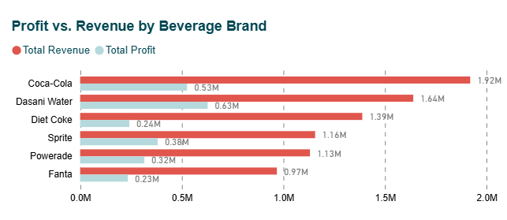
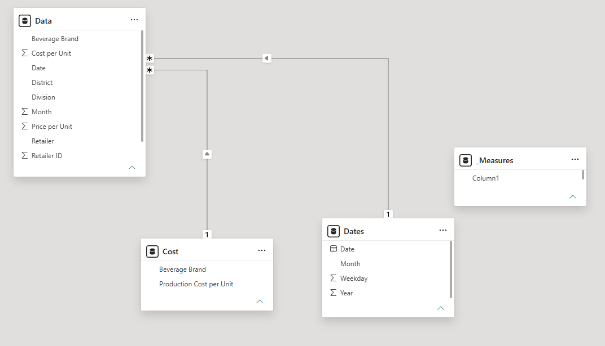
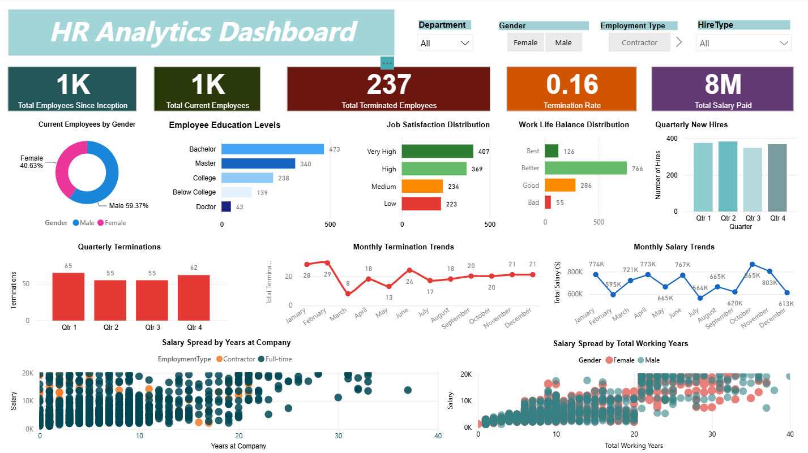
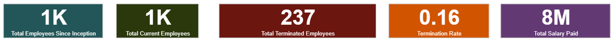
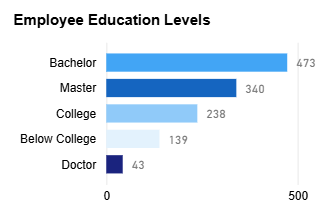
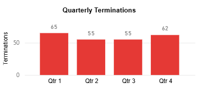
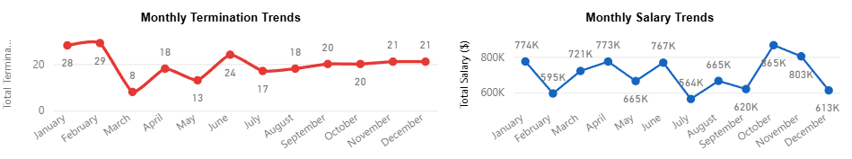
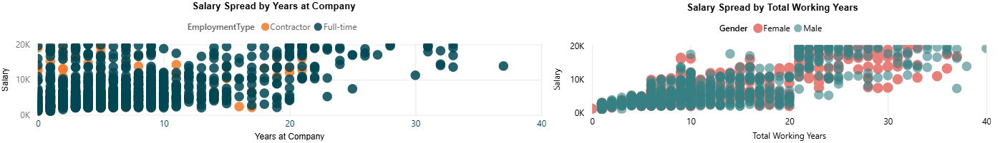

<div align="center">


<p>
  
  
  
  
</p>

<p>
  
  
  
  
</p>

<br/>

> ### 📊 *A two-project Power BI portfolio demonstrating end-to-end business intelligence skills*
> *From beverage sales performance tracking to full HR workforce analytics*

<br/>

</div>

---

## 📌 Table of Contents

- [Portfolio Overview](#-portfolio-overview)
- [Challenge 1 — Beverage Sales Dashboard](#-challenge-1--beverage-sales-dashboard)
- [Challenge 2 — HR Analytics Dashboard](#-challenge-2--hr-analytics-dashboard)
- [How to Run Both Dashboards](#-how-to-run-both-dashboards)
- [Project Structure](#-project-structure)
- [Tools & Technologies](#-tools--technologies)
- [Key Skills Demonstrated](#-key-skills-demonstrated)
- [Author](#-author)

---

## 📖 Portfolio Overview

This repository contains two Power BI dashboard projects in one report file. It demonstrates business intelligence skills across sales and HR analytics, including data modeling, DAX, filtering, trend analysis, and dashboard storytelling.

The Power BI report is stored in:

- `powerbi-challenge-1 and 2/Beverage_Sales_Dashboard.pbix`

### Report Pages

| Page | Focus | Highlights |
|:---|:---|:---|
| 🥤 Beverage Sales | Beverage revenue, profit, and regional performance | Sales KPIs, trend analysis, brand comparisons |
| 👥 HR Analytics | Employee headcount, attrition, satisfaction, hiring, and salary | Workforce metrics, turnover analysis, compensation insights |

---

## 🥤 Challenge 1 — Beverage Sales Dashboard

### Overview

An interactive beverage sales dashboard built on a clean model with sales, calendar, and cost data.

### Data Sources

- `data/Beverage_Sales_Data_C1.xlsx`

### Key Measures

```dax
Total Revenue = SUMX('Data', 'Data'[Units Sold] * 'Data'[Price per Unit])
Total Profit = [Total Revenue] - [Total Cost]
```

### Dashboard Features

- slicers for Division, District, and Beverage Brand
- KPI cards for revenue, units sold, and average price
- line charts for month and day sales trends
- donut chart for brand revenue share
- clustered bar chart for profit vs. revenue by brand

### Screenshots







---

## 👥 Challenge 2 — HR Analytics Dashboard

### Overview

A workforce analytics dashboard built from a comprehensive HR dataset, offering insights into employee headcount, attrition, satisfaction, hiring trends, and salary distribution.

### Data Sources

- `data/HR_Employee_Data_C2.xlsx`

### Key Measures

```dax
Total Current Employees =
CALCULATE(
    DISTINCTCOUNT('HR_Data'[ID_employe]),
    'HR_Data'[Attrition] = "No"
)

Termination Rate =
DIVIDE(
    [Total Terminated Employees],
    [Total Employees Since Inception],
    0
)

Total Salary Paid =
CALCULATE(
    SUM('HR_Data'[Salary]),
    'HR_Data'[Attrition] = "No"
)
```

### Dashboard Features

- slicers for Department, Gender, Employment Type, and Hire Type
- KPI cards for current employees, terminations, termination rate, and total salary
- donut chart for gender distribution
- bar charts for education level, job satisfaction, and work-life balance
- column charts for quarterly hires vs. terminations
- line charts for termination and salary trends
- scatter charts for salary vs. experience analysis

### Screenshots








---

## 🚀 How to Run Both Dashboards

### Prerequisites

- ✅ Microsoft Power BI Desktop (free)
- ✅ Windows 10 or later

### Setup Instructions

1. Clone or download the repository:

```bash
git clone https://github.com/Tansiv/Power-BI-Assignment.git
```

2. Open the Power BI file:

- `powerbi-challenge-1 and 2/Beverage_Sales_Dashboard.pbix`

3. If the dashboard does not load data automatically:

- open Power BI Desktop
- go to `Home` → `Transform Data` → `Data Source Settings`
- update the source paths to the files inside the `data/` folder
- close and apply changes

4. Explore the report:

- select slicers to filter results
- click visuals to cross-filter
- review KPIs, trends, and comparisons on both pages

---

## 📁 Project Structure

```
Power-BI-Assignment/
├── data/
│   ├── Beverage_Sales_Data_C1.xlsx
│   └── HR_Employee_Data_C2.xlsx
├── powerbi-challenge-1 and 2/
│   └── Beverage_Sales_Dashboard.pbix
├── screenshots/
│   ├── challenge-1-beverage-sales/
│   │   ├── bar_chart.png
│   │   ├── dashboard_overview.png
│   │   ├── data_model.png
│   │   ├── donut_chart.png
│   │   ├── kpi_cards.png
│   │   └── line_charts.png
│   └── challenge-2-hr-analytics/
│       ├── dashboard_overview.png
│       ├── data_model.png
│       ├── education_satisfaction_charts.png
│       ├── kpi_cards.png
│       ├── monthly_trends.png
│       ├── quarterly_hires_terminations.png
│       └── scatter_charts.png
└── README.md
```

---

## 🛠️ Tools & Technologies

| Tool | Purpose |
|:---|:---|
| Power BI Desktop | Report development and visualization |
| DAX | Calculated measures and business logic |
| Power Query | Data transformation and preparation |
| Microsoft Excel | Source data storage |
| GitHub | Version control and sharing |

---

## 💡 Key Skills Demonstrated

- data modeling with linked tables and calendar logic
- DAX measure creation for revenue, profit, attrition, and salary metrics
- interactive dashboard design with filters and cross-highlighting
- sales and workforce analytics storytelling
- report exploration using slicers and drill-through actions

---

## 👤 Author

Power BI portfolio for dashboard analytics and business intelligence review.
