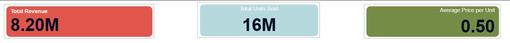
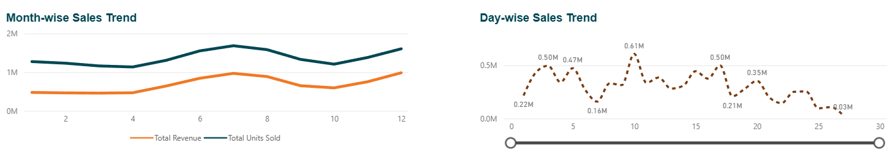
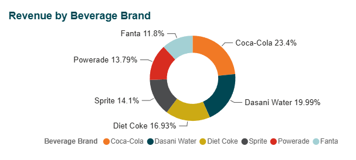

<div align="center">

<!-- ANIMATED HEADER BANNER -->


<!-- BADGES ROW -->
<p>
  
  
  
  
  
</p>

<p>
  
  
  
  
</p>

<br/>

> ### 📊 *An end-to-end interactive sales intelligence dashboard built with Microsoft Power BI*
> *Analyzing beverage brand performance across divisions, districts, and time periods*

<br/>

</div>

---

## 📌 Table of Contents

<div align="center">

| # | Section |
|:---:|:---|
| 1 | [📖 Project Overview](#-project-overview) |
| 2 | [🗂️ Data Sources](#️-data-sources) |
| 3 | [🔗 Data Model & Relationships](#-data-model--relationships) |
| 4 | [📐 DAX Measures](#-dax-measures) |
| 5 | [📊 Dashboard Visuals](#-dashboard-visuals) |
| 6 | [🖥️ Dashboard Screenshots](#️-dashboard-screenshots) |
| 7 | [🚀 How to Run](#-how-to-run) |
| 8 | [📁 Project Structure](#-project-structure) |
| 9 | [🛠️ Tools & Technologies](#️-tools--technologies) |
| 10 | [👤 Author](#-author) |

</div>

---

## 📖 Project Overview

<table>
<tr>
<td width="60%">

This project is **Challenge 1** of a Power BI Business Intelligence series. The goal was to build a fully interactive **Beverage Sales Performance Dashboard** from raw data across three relational tables.

The dashboard empowers business users to:
- 📈 Track **revenue and profit trends** over time
- 🧃 Analyze **beverage brand performance** side by side
- 🗺️ Filter insights by **Division** and **District**
- 📅 Explore **month-wise and day-wise** sales patterns
- 💰 Monitor **key KPIs** through live metric cards

</td>
<td width="40%" align="center">

```
📦 Challenge 1
├── 3 Data Tables
├── 2 Relationships
├── 5 DAX Measures
├── 3 Slicer Filters
├── 3 KPI Cards
├── 2 Line Charts
├── 1 Donut Chart
└── 1 Bar Chart
```

</td>
</tr>
</table>

---

## 🗂️ Data Sources

> Three tables were loaded from an Excel workbook via **Power BI → Get Data → Excel Workbook**

<br/>

### 🟦 Table 1 — `Data` (Fact Table)
> The main transactions table. Each row = one sales record.

| Column | Data Type | Description |
|:---|:---:|:---|
| `Date` | 📅 Date | Date of the sale transaction |
| `Month` | 🔢 Number | Numeric month of the sale |
| `Division` | 🔤 Text | Sales division (geographic zone) |
| `District` | 🔤 Text | District within the division |
| `Retailer` | 🔤 Text | Name of the retail outlet |
| `Retailer ID` | 🔢 Number | Unique retailer identifier |
| `Beverage Brand` | 🔤 Text | Name of the beverage brand |
| `Units Sold` | 🔢 Number | Quantity of units sold |
| `Price per Unit` | 💲 Decimal | Selling price per unit |
| `Cost per Unit` | 💲 Decimal | Cost price per unit |

<br/>

### 🟩 Table 2 — `Dates` (Date Dimension Table)
> Calendar lookup table used for time intelligence.

| Column | Data Type | Description |
|:---|:---:|:---|
| `Date` | 📅 Date | Unique date (primary key) |
| `Month` | 🔢 Number | Month number (1–12) |
| `Weekday` | 🔢 Number | Day of the week (1–7) |
| `Year` | 🔢 Number | Calendar year |

<br/>

### 🟨 Table 3 — `Cost` (Cost Dimension Table)
> Reference table for production cost per brand.

| Column | Data Type | Description |
|:---|:---:|:---|
| `Beverage Brand` | 🔤 Text | Name of the brand (primary key) |
| `Production Cost per Unit` | 💲 Decimal | Manufacturing cost per unit |

---

## 🔗 Data Model & Relationships

```
                    ┌──────────────────────┐
                    │       Dates          │
                    │──────────────────────│
                    │  📅 Date  (PK - 1)  │
                    │  Month               │
                    │  Weekday             │
                    │  Year                │
                    └──────────┬───────────┘
                               │
                               │  Many-to-One  (★ → 1)
                               │  Join: Date = Date
                               │
               ┌───────────────▼──────────────────┐
               │              Data                 │
               │──────────────────────────────────│
               │  Date           (FK → Dates)      │
               │  Beverage Brand (FK → Cost)       │
               │  Division  |  District            │
               │  Retailer  |  Retailer ID         │
               │  Units Sold | Price per Unit      │
               │  Cost per Unit | Month            │
               └───────────────┬──────────────────┘
                               │
                               │  Many-to-One  (★ → 1)
                               │  Join: Beverage Brand = Beverage Brand
                               │
                    ┌──────────▼───────────┐
                    │         Cost         │
                    │──────────────────────│
                    │  Beverage Brand (PK) │
                    │  Production Cost/Unit│
                    └──────────────────────┘
```

> **Cardinality:** Both relationships are **Many-to-One (★:1)**
> **Filter Direction:** Single (from dimension → fact table)

---

## 📐 DAX Measures

> All measures are stored in a dedicated `_Measures` table for clean organization.

<br/>

### 💰 Measure 1 — Total Revenue

```dax
Total Revenue =
SUMX(
    'Data',
    'Data'[Units Sold] * 'Data'[Price per Unit]
)
```
> Loops through every row in the Data table and multiplies Units Sold by Price per Unit, then sums the result.

<br/>

### 📦 Measure 2 — Total Units Sold

```dax
Total Units Sold = SUM('Data'[Units Sold])
```
> Simple aggregation of all units sold across the filtered context.

<br/>

### 💲 Measure 3 — Average Price per Unit

```dax
Average Price per Unit =
DIVIDE(
    [Total Revenue],
    [Total Units Sold],
    0
)
```
> Uses `DIVIDE()` instead of `/` to safely return 0 when Units Sold = 0 (avoids divide-by-zero errors).

<br/>

### 🏭 Measure 4 — Total Cost

```dax
Total Cost =
SUMX(
    'Data',
    'Data'[Units Sold] * 'Data'[Cost per Unit]
)
```
> Calculates total cost of goods sold across all transactions.

<br/>

### 📈 Measure 5 — Total Profit

```dax
Total Profit = [Total Revenue] - [Total Cost]
```
> Gross profit = Revenue minus Cost. Inherits all slicer and filter context automatically.

---

## 📊 Dashboard Visuals

<div align="center">

| # | Visual Type | Configuration | Purpose |
|:---:|:---|:---|:---|
| 1 | 🎚️ **Slicer** | Field: `Division` | Filter all visuals by sales division |
| 2 | 🎚️ **Slicer** | Field: `District` | Filter all visuals by district |
| 3 | 🎚️ **Slicer** | Field: `Beverage Brand` | Filter all visuals by brand |
| 4 | 🃏 **KPI Card** | Measure: `Total Revenue` | Display total revenue at a glance |
| 5 | 🃏 **KPI Card** | Measure: `Total Units Sold` | Display total quantity sold |
| 6 | 🃏 **KPI Card** | Measure: `Average Price per Unit` | Display average selling price |
| 7 | 📈 **Line Chart** | X: Month \| Y: Revenue + Units | Month-wise sales trend over time |
| 8 | 📈 **Line Chart** | X: Date \| Y: Total Revenue | Day-wise granular sales trend |
| 9 | 🍩 **Donut Chart** | Legend: Brand \| Value: Revenue | Brand revenue share distribution |
| 10 | 📊 **Clustered Bar** | Y: Brand \| X: Revenue + Profit | Side-by-side profit vs revenue |

</div>

---

## 🖥️ Dashboard Screenshots

<br/>

> 📸 **To add screenshots:** Place your `.png` or `.jpg` images in the `/screenshots/` folder and they will display here automatically.

<br/>

### 🖼️ Full Dashboard Overview

```
📂 screenshots/
    └── dashboard_overview.png     ← Replace with your screenshot
```

<!-- REPLACE THE LINE BELOW WITH YOUR ACTUAL SCREENSHOT AFTER TAKING IT -->


---

### 🖼️ KPI Cards — Revenue, Units, Avg Price

```
📂 screenshots/
    └── kpi_cards.png              ← Replace with your screenshot
```



---

### 🖼️ Month-wise & Day-wise Sales Trends

```
📂 screenshots/
    └── line_charts.png            ← Replace with your screenshot
```



---

### 🖼️ Donut Chart — Brand Distribution

```
📂 screenshots/
    └── donut_chart.png            ← Replace with your screenshot
```



---

### 🖼️ Clustered Bar — Profit vs Revenue

```
📂 screenshots/
    └── bar_chart.png              ← Replace with your screenshot
```


---

### 🖼️ Data Model View

```
📂 screenshots/
    └── data_model.png             ← Replace with your screenshot
```


---

> 💡 **How to take screenshots in Power BI:**
> - Full dashboard: Press `Windows + Shift + S` → drag to select the canvas area → paste into Paint and save as `.png`
> - Model view: Switch to Model View → `Windows + Shift + S` → save as `data_model.png`
> - Place all images inside a `screenshots/` folder in your repo root

---

## 🚀 How to Run

### Prerequisites

Before opening this file, make sure you have:

- ✅ **Microsoft Power BI Desktop** installed (free) → [Download here](https://powerbi.microsoft.com/desktop/)
- ✅ Windows 10 or later
- ✅ Minimum 4GB RAM (8GB recommended)

<br/>

### Step-by-Step Setup

**Step 1 — Clone or Download this Repository**
```bash
# Clone via Git
git clone https://github.com/Tansiv/Power-BI-Assignment.git

# OR click the green "Code" button above → "Download ZIP" → Extract it
```

**Step 2 — Open the Power BI File**
```
1. Navigate to the project folder
2. Double-click:  Beverage_Sales_Dashboard.pbix
3. Power BI Desktop will launch and open the report
```

**Step 3 — If Data Refresh Fails**
```
1. Click Home → Transform Data → Data Source Settings
2. Update the file path to where your Excel source file is located
3. Click Close & Apply
4. The dashboard will refresh with live data
```

**Step 4 — Interact with the Dashboard**
```
✅ Use the slicers (Division / District / Beverage Brand) to filter
✅ Click any chart element to cross-filter other visuals
✅ Hover over data points to see tooltips
✅ Use the zoom slider on the day-wise chart to drill into date ranges
```

---

## 📁 Project Structure

```
📦 Beverage Sales Performance Dashboard/
│
├── 📂 powerbi-challenge-01/
│   └── 📊 Beverage_Sales_Dashboard.pbix    ← Main Power BI report file
│
├── 📂 data/
│   └── 📗 Beverage_Sales_Data.xlsx     ← Source Excel file (3 tables)
│       ├── Sheet: Data
│       ├── Sheet: Dates
│       └── Sheet: Cost
│
├── 📂 screenshots/
│   ├── 🖼️ dashboard_overview.png       ← Full dashboard view
│   ├── 🖼️ kpi_cards.png               ← Revenue, Units, Avg Price cards
│   ├── 🖼️ line_charts.png             ← Month-wise & Day-wise trends
│   ├── 🖼️ donut_chart.png             ← Brand distribution donut
│   ├── 🖼️ bar_chart.png               ← Profit vs Revenue bar chart
│   └── 🖼️ data_model.png              ← Relationship model diagram
│
└── 📄 README.md                        ← This file
```

---

## 🛠️ Tools & Technologies

<div align="center">

| Tool | Version | Purpose |
|:---|:---:|:---|
|  | Latest | Report building & visualization |
|  | — | Data modeling & measure calculations |
|  | — | Data transformation & cleaning |
|  | 2019+ | Source data file format |
|  | — | Version control & project hosting |

</div>

---

## ✅ Challenge Task Completion

<div align="center">

| Task | Description | Status |
|:---:|:---|:---:|
| 1 | Data Import (Data, Dates, Cost tables) | ✅ Done |
| 2 | Data Modeling & Relationships | ✅ Done |
| 3 | Slicers — Division, District, Beverage Brand | ✅ Done |
| 4 | DAX Measures — Revenue, Units, Avg Price | ✅ Done |
| 5 | KPI Cards — 3 visual metric cards | ✅ Done |
| 6 | Line Chart — Month-wise Sales Trend | ✅ Done |
| 7 | Line Chart — Day-wise Sales Trend | ✅ Done |
| 8 | Donut Chart — Beverage Brand Distribution | ✅ Done |
| 9 | Clustered Bar — Profit vs Revenue by Brand | ✅ Done |
| 10 | Final Polish & Professional Layout | ✅ Done |

</div>

---

## 💡 Key Insights & Learnings

- **SUMX vs SUM** — `SUMX` is essential when revenue must be calculated row-by-row (Units × Price) before aggregating. `SUM` alone cannot do this multiplication.
- **DIVIDE() over /** — Always use `DIVIDE(numerator, denominator, 0)` in DAX to gracefully handle zero-division scenarios.
- **Date Table Best Practice** — A dedicated `Dates` table with a unique date per row is the foundation of all time intelligence in Power BI.
- **Many-to-One Relationships** — The fact table (`Data`) always sits on the "many" (★) side; dimension tables (`Dates`, `Cost`) sit on the "one" (1) side.
- **_Measures Table** — Storing all DAX measures in a dedicated dummy table keeps the Fields pane organized and professional.

---

## 👤 Author

<div align="center">

<br/>

**Tansiv Jubayer**

[](https://github.com/Tansiv)
[](https://www.linkedin.com/in/tansiv-jubayer/)

*Power BI | Data Analytics | Business Intelligence*

<br/>

---


*⭐ If you found this project helpful, please consider giving it a star!*

</div>